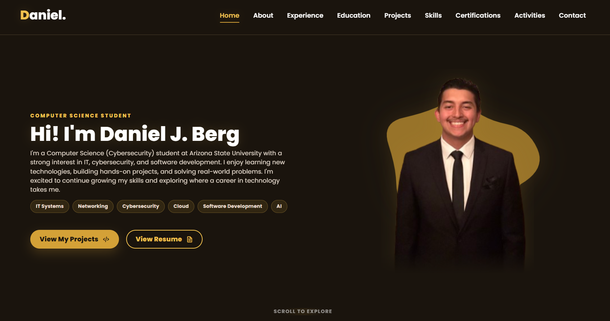
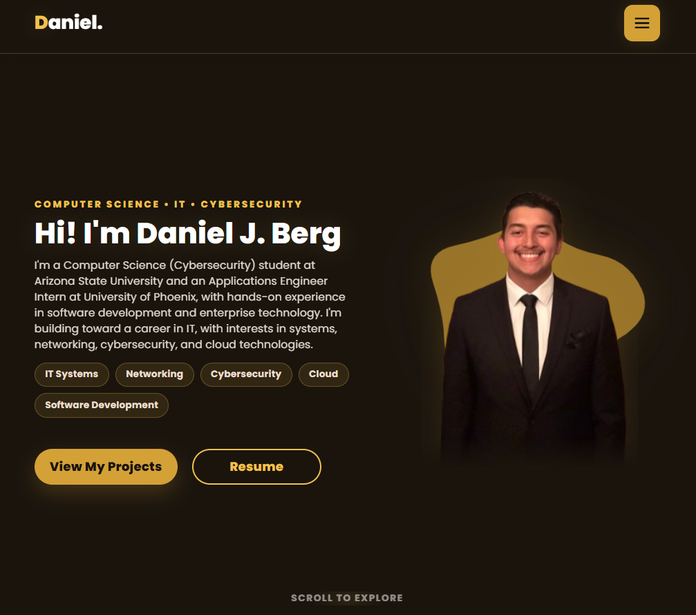

# 🌐 Personal Portfolio Website

A responsive personal portfolio website designed and developed to showcase my **professional experience, technical projects, skills, certifications, and background across software engineering, information technology, and cybersecurity**.

Built from the ground up with **HTML, CSS, and JavaScript**, deployed through **GitHub Pages**, and connected to a custom domain with HTTPS.

🌐 **Live Website:** [danieljberg.com](https://danieljberg.com)

---

## 📸 Project Preview



*Desktop view of the personal portfolio website.*

---

## 🎯 Project Overview

I designed and developed this website as a central portfolio for presenting my professional experience, technical projects, skills, and continued development.

Rather than using a website builder or portfolio template, the site was built with **HTML, CSS, and JavaScript**, providing direct control over its structure, styling, responsive behavior, and interactive functionality.

---

## ✨ Key Features

- 📱 **Responsive Design** — Layouts optimized for desktop, intermediate, and mobile screen sizes
- 🧭 **Responsive Navigation** — Desktop navigation with a mobile hamburger menu
- 💼 **Experience & Projects** — Dedicated sections for professional experience and technical projects
- 🛠️ **Skills & Certifications** — Organized presentation of technologies, tools, training, and certifications
- 📬 **Functional Contact Form** — Contact form integrated with EmailJS
- 🌐 **Public Deployment** — Hosted through GitHub Pages with a custom domain and HTTPS

---

## 📱 Responsive Design

The website was designed to maintain its visual identity and usability across different screen sizes rather than simply shrinking the desktop layout.

### Responsive View



### Mobile View


Responsive behavior includes adjustments to:

- Navigation
- Typography
- Section spacing
- Content positioning
- Project cards
- Images
- Buttons
- Header behavior

These changes allow the same portfolio content to remain accessible and visually consistent across desktop, tablet-sized, and mobile displays.

---

## 🛠️ Technology Stack

| Area | Technologies |
| --- | --- |
| **Structure** | HTML5 |
| **Styling** | CSS3 |
| **Interactivity** | JavaScript |
| **Contact Integration** | EmailJS |
| **Version Control** | Git, GitHub |
| **Hosting** | GitHub Pages |
| **Development** | Visual Studio Code |
| **Domain** | Custom Domain + HTTPS |

---

## ⚙️ Frontend Functionality

The website uses lightweight frontend technologies without requiring a JavaScript framework.

Implemented functionality includes:

- Responsive desktop and mobile navigation
- Mobile hamburger menu behavior
- DOM manipulation
- Interactive page elements
- Contact form handling
- Project and external profile navigation
- Responsive interface behavior

HTML provides the site structure, CSS controls the visual design and responsive layouts, and JavaScript handles interactive behavior.

---

## 📬 Contact Integration

The website includes a functional contact form powered by **EmailJS**.

```text
Portfolio Contact Form
         │
         ▼
     JavaScript
         │
         ▼
      EmailJS
         │
         ▼
   Email Delivery
```

This allows visitors to send a message directly through the portfolio without requiring a custom backend email server.

---

## 🚀 Deployment

The website is deployed through **GitHub Pages** and connected to a custom domain with HTTPS.

```text
Local Development
       │
       ▼
      Git
       │
       ▼
     GitHub
       │
       ▼
 GitHub Pages
       │
       ▼
 Custom Domain
       │
       ▼
     HTTPS
```

🌐 **Live Website:** [danieljberg.com](https://danieljberg.com)

Git-based deployment provides a straightforward workflow for maintaining and updating the portfolio as new experience, projects, and skills are added.

---

## 📂 Website Content

The portfolio organizes my professional and technical background into dedicated sections:

```text
Portfolio
│
├── Home
├── About
├── Experience
├── Skills
├── Projects
├── Certifications
└── Contact
```

Together, these sections provide a centralized view of my experience, technical development, and project work.

---

## 💡 What This Project Demonstrates

Building and maintaining the portfolio demonstrates experience with:

- Responsive frontend development
- HTML, CSS, and JavaScript
- Responsive UI/UX design
- DOM manipulation and frontend interactivity
- Third-party service integration
- Git and GitHub version control
- GitHub Pages deployment
- Custom domain and HTTPS configuration
- Cross-device interface testing
- Iterative website development and maintenance

The project demonstrates the complete process of taking a frontend website from **design and development through deployment and continued maintenance**.

---

## 📬 Connect With Me

- 🌐 [Portfolio](https://danieljberg.com)
- 💼 [LinkedIn](https://www.linkedin.com/in/danieljberg/)
- 💻 [GitHub](https://github.com/dj-berg)
- 📧 Email: danielberg313@gmail.com

---

<p align="center">
  <strong>Designed & developed by Daniel J. Berg</strong>
</p>
